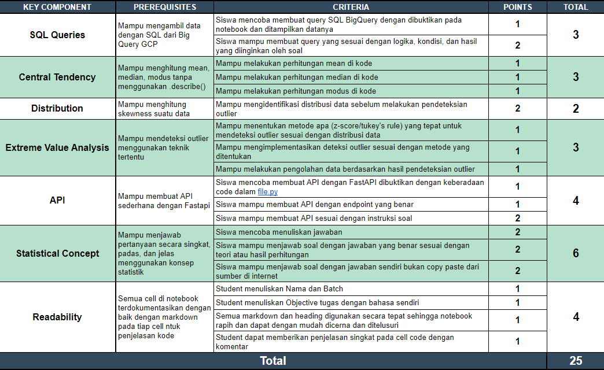

# Live Code 3 - Set 1

_Live Code 3 ini dibuat guna mengevaluasi pembelajaran pada Hacktiv8 Data Science Fulltime Program khususnya pada konsep SQL, statistika, dan  API._

_version: GAIAv2.2_

_update date: 20250312_

---

## Objectives

*Live Code 3* ini dibuat dengan tujuan sebagai berikut :

- Mampu mengkoneksikan Python dengan Google BigQuery.

- Mampu melakukan pengambilan data dengan menggunakan SQL.

- Mampu menerapkan konsep Central Tendency, Data Distribution, dan Descriptive Statistics.

- Mampu menerapkan konsep Extreme Value Analysis.

- Mampu membuat API sederhana dengan FastAPI.

---

## Dataset

1. Pada tugas kali ini, dataset yang akan Anda gunakan berasal dari Google BigQuery. Gunakan informasi dibawah ini sebagai tempat untuk mengambil dataset.
   - Project ID : `bigquery-public-data`
   - Dataset    : `iowa_liquor_sales`
   - Tabel      : `sales`

2. Anda dapat mengkoneksikan notebook pada Google Colab dengan Google BigQuery dengan Python code berikut :

   ```py
   from google.colab import auth
   from google.cloud import bigquery
   auth.authenticate_user()
   print('Authenticated')
   
   project_id_akun = "my-project-317907" # Gunakan GCP Project-ID Anda
   client = bigquery.Client(project=project_id_akun)
   ```

3. Buatlah SQL query untuk mengambil data dari informasi poin 1 dengan ketentuan : 
   - Ambil hanya column `state_bottle_retail`.
   - Filter data dengan kondisi dimana column `vendor_name` bernilai `SAZERAC COMPANY  INC`.
   - Anda tidak perlu melakukan filter apapun terhadap column `state_bottle_retail`. Biarkan nilai ini apa adanya.
   - Batasi data yang diambil sebanyak 5000 entry.

4. Untuk melakukan query SQL dengan menggunakan Google Colab, Anda dapat menggunakan method `client.query('query-sql-anda').to_dataframe()`. Output dari sintaks ini berupa Pandas DataFrame. Contoh:

   ```py
   df = client.query('''
   SELECT *
   FROM `bigquery-public-data.thelook_ecommerce.orders`
   WHERE created_at < "2022-07-01"
   ''').to_dataframe()
   ```

5. Lakukan pengolahan SQL pada Notebook Google Colaboratory. 

6. **Dalam Live Code 3 ini, Anda dilarang bertanya terkait dengan SQL meskipun hanya sebatas cara mengambil data dari Google BigQuery kepada pengawas Live Code.** Silakan cek dengan seksama pengerjaan yang Anda buat.

## Problem

Anda adalah seorang Data Analyst pada sebuah perusahaan produsen dan distributor minuman keras bernama `Sazerac Company`. Tim marketing perusahaan Anda ingin melakukan sebuah campaign promo terhadap harga minuman keras dimana mereka membutuhkan data harga dengan tidak adanya outlier pada data tersebut. Anda diberi tugas untuk mengidentifikasi data harga minuman keras yang bersifat anomaly atau outlier ini.

###  Section 1 - Anomaly Analysis

Untuk melakukan pengecekan data anomaly atau data outlier, lakukanlah beberapa langkah dibawah ini :

1. Lakukan perhitungan Central Tendency (Mean, Median, dan Modus) terhadap data yang telah Anda peroleh.

2. Cek nilai skewness data untuk mengetahui apakah data terdistribusi normal atau tidak.

3. Lakukan pengolahan data dengan menggunakan Extreme Value Analysis. Nyatakan secara jelas berapa banyak persentase outlier yang Anda temukan.

4. Buatlah sebuah variabel baru yang menyimpan data bersih yang sudah tidak memiliki data outlier.

5. Simpan data yang sudah bersih ini ke dalam sebuah file CSV dengan format `P0LC3_<nama-student>_data_clean.csv`.

### Section 2 - API

1. Buatlah sebuah Python file yang berisi script API sederhana menggunakan FastAPI untuk menampilkan data yang sudah bersih (data yang sudah tidak ada lagi anomalinya).

2. Petunjuk : 
   - Load data CSV yang sudah Anda simpan sebelumnya.
   - Lakukan konversi tipe data ke dalam tipe data dictionary. Anda dapat menggunakan sintaks `df.to_dict()` atau `df.to_json()` agar dapat  ditampilkan dengan API menggunakan FastAPI.

3. Simpan Python file ini dengan format `P0LC3_<nama-student>_app.py`.

### Section 3 - Data Analysis

Jawablah pertanyaan-pertanyaan dibawah ini berdasarkan hasil yang Anda peroleh sebelumnya. Anda dapat menggunakan Markdown untuk memperjelas jawaban Anda.

1. Berapa nilai rata-rata, median, dan modus dari data yang Anda peroleh sebelum dihilangkan outliernya ? Bagaimana kecenderungan pemusatan datanya ? Jelaskan analisa Anda !

2. Berdasarkan nilai skewness yang Anda peroleh, bagaimana dengan distribusi datanya? Jelaskan analisa Anda !

3. Ada dua teknik yang dapat dipakai untuk melakukan Extreme Value Analysis. Teknik manakah yang Anda pakai ? Berikan alasan Anda memakainya dengan berdasarkan data !

---

## Instructions

*Live Code 3* dikerjakan dalam format ***notebook*** dengen beberapa **kriteria wajib** di bawah ini:

1. Isi *notebook* harus mengikuti *outline* di bawah ini:
    1. Perkenalan
        
        > Bab pengenalan harus diisi dengan identitas (Nama dan Batch) dan objective yang ingin dicapai.

    2. Answer
        
        > Bagian ini berisi proses dalam menjawab soal. Setiap soal dikerjakan dalam satu cell terpisah dan berikan judul soal dengan markdown sebelum cell code.

2. Notebook **wajib** memberikan keterangan atau pengenalan dengan menggunakan `markdown` yang berisikan Judul tugas, Nama, Batch, dan penjelasan singkat tentang program yang dibuat. Contoh :
    
    ```
    =================================================
    Live Code 3

    Nama  : Fahmi Iman Alfarizki
    Batch : BSD-50

    Program ini dibuat untuk melakukan automatisasi pengolahan (cleaning) data text yang berguna untuk pemodelan model analisa sentimen.
    =================================================
    ``` 

3. Setiap class, method, atau function yang dibuat wajib diberikan penjelasan mengenai kegunaan class/method/function tersebut beserta alur algoritmanya dengan menggunakan `docstring`.
    ```py
    def f(x):
      '''
      Fungsi ini ditujukan untuk menghitung kuadrat angka yang dimasukkan pengguna dengan rumus x^2.
  
      Argument x merupakan inputan angka berupa bilangan real.
  
      Contoh penggunaan:
        y = f(2)
        print(y)
        --------
        Output: 4
      '''
      return x**2
    ```

4. **WARNING**: Plagiarisme sekecil apapun dapat terdeteksi. Tugas ini akan diuji tingkat plagiarismenya dengan software khusus.

---

## Submission

- Simpan assignment Live Code 3 ini dengan nama :
  + Format penamaan file Python Notebook : `P0LC3_<nama-student>.ipynb`. Misal : `P0LC3_fahmi_iman.ipynb`.
  + Format penamaan file Python Script : `P0LC3_<nama-student>_app.py`. Misal : `P0LC3_fahmi_iman_app.py`.
  + Format penamaan file data clean : `P0LC3_<nama-student>_data_clean.csv`. Misal : `P0LC3_fahmi_iman_data_clean.csv`

- Push Assignment yang telah Anda buat ke repository tugas GitHub Classroom Anda.

- Contoh bentuk repository :
  ```
  P0-LC3-Set-1/fahmi-iman
  |
  ├── assignment-rubrics.png
  ├── P0LC3_fahmi_iman.ipynb
  ├── P0LC3_fahmi_iman_app.py
  ├── P0LC3_fahmi_iman_data_clean.csv
  └── README.md
  ```

---

## Rubrics



----

## Notes

* **Deadline pengerjaan : pukul 12:00 WIB.**

* **Deadline submit jawaban : pukul 12:15 WIB.**

* **Keterlambatan pengumpulan tugas mengakibatkan skor LC 3 menjadi 0.**

* **Akses repository Live Code akan ditutup bila telah melewati batas waktu pengumpulan dan Live Code diberi poin nol.**
